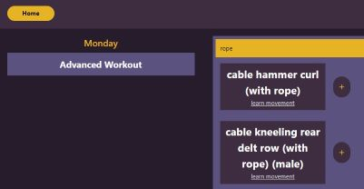

# Spotter

## Description
Spotter is an online application to be used for creating, storing, and doing workouts. 
Through a simple process of selecting exercises, the user can build their own workout routines using their favorite exercises or new ones! Spotter can help you learn how to perform movements on the fly, so it's the perfect gym buddy. 

## Table of Contents

- [Installation](#installation)
- [Usage](#usage)
- [Contributing](#contributing)
- [Authors](#authors)

## Installation
To install this project use the following link: https://github.com/mhengerer/Spotter and follow these simple directions:

Above the list of files, click on the "Code" button.

Copy the URL for the repository.

Open Git Bash.

Change the current working directory to the location where you want the cloned directory.

Type git clone, and then paste the URL you copied earlier.

Press Enter to create your local clone.

For more help and information achiving this, check out the following website: https://docs.github.com/en/repositories/creating-and-managing-repositories/cloning-a-repository

## Usage
The refactored website can be found at: https://project-2-spotter.herokuapp.com/

The following images demonstrate the application's appearance and functionality:

## Authors

- [Dylan Freeman](https://github.com/templarmanatee)
- [Michael Hengerer](https://github.com/mhengerer/)
- [Diana Santacruz](https://github.com/dianavw8)
- [Maia Ferrer](https://github.com/maiaferrer)
- [Jagmit Cheema](https://github.com/007jag)
- [Shaniya Kindle](https://github.com/Skindle)

## Contributing

The following are contributers to the making of the Spotter project:

https://tailwindcss.com/

https://iconify.design/

